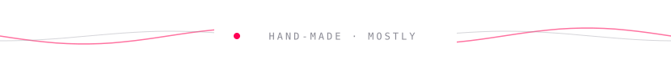

 

<!--
  when a project goes public, swap the slot image for a line like:
  **[name](https://github.com/whosdrix/name)** &nbsp;·&nbsp; what it does, in plain words &nbsp;·&nbsp; `stack`
-->

 

 

 

  <a href="https://instagram.com/whosdrix"><b>instagram</b></a> &nbsp;/&nbsp;
  <a href="https://discord.gg/quRYpJtMgY"><b>discord</b></a> &nbsp;/&nbsp;
  <a href="mailto:drixikk@gmail.com"><b>drixikk@gmail.com</b></a>
    
  if something here saved you an hour, a ⭐ is a nice way to say so.

